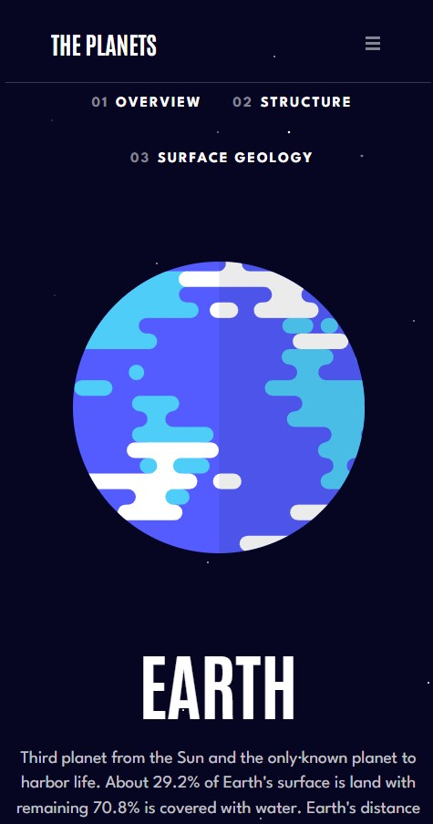

# Planet facts

This is an 8-page fact site for all planets in our solar system (React, React Router DOM)

Animation is realized with [Framor Motion](https://www.framer.com/motion/introduction/). This is an open source motion library for React.

Live - https://planets-fact-site-00.web.app/

## Features

- View each planet page and toggle between the "Overview", "Internal Structure", and "Surface Geology" tabs.
- View the optimal layout for the app depending on their device's screen size.
